# final_comic_reader

Comic Reader Application - Flutter Android

Members:
* Nguyễn Hoàng Minh Thư
* Lê Đức Thắng

Workloads sheet: [link](https://docs.google.com/spreadsheets/d/1onvR61u1fTW0O2I8wkWvt1UWuoJXeoOkO_R2St4fFT0/edit?usp=sharing)

# ForYouScreen
Display this screen when app first is loaded.

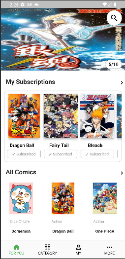

Carousel displaying 10 comics banner, auto sliding and can also link to DetailScreen of comic on click.

My subscriptions section displays comics that user has subscribed to.

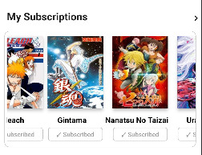

All comics section to display all comic that our system currently has.

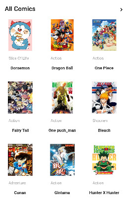

# SearchScreen
Display when clicking on the search icon button on the on of ForYouScreen. Search function filters comics by its name on typing.

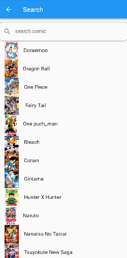
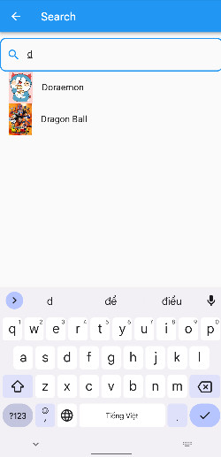

# CategoryScreen
Display comics by its category saved in database, one category per each tab bar view (1 comic can contain multiple categories).

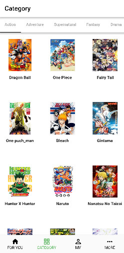
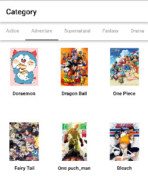

# MyScreen
Display comics in a ListView of all comics that the user has subscribed to.

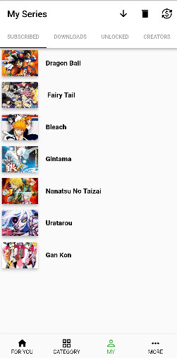

# MoreScreen
Display current user information: name and log in status. A log in button if user is not logged in, and change to login button when user is logged in.

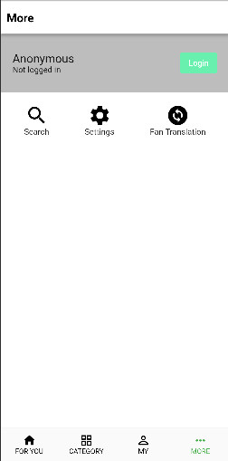

# CreateAccountScreen
Display when user clicks the CREATE ACCOUNT text button in MoreScreen.

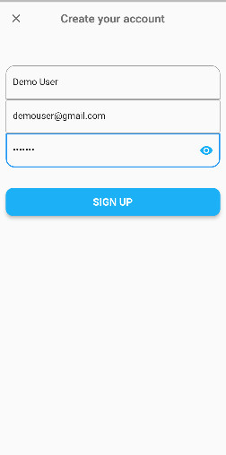

We will demo creating a user account, when user clicks the SIGN UP button, it will automatically prompts to LoginScreen if account is created successfully.

# LoginScreen
Display when user clicks the log in button in MoreScreen or prompting from CreateAccountScreen.

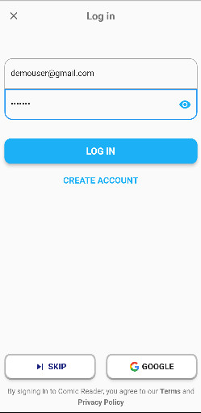

When account is logged in with valid credentials, user will be promted to ForYouScreen. Meanwhile, if we navigate to MoreScreen it will display the customer information: name and log in status, along with a LOG OUT button.

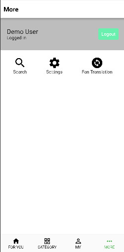

# DetailScreen
Display detail of each comic with a subscribe button to tell the status 'isSubscribed' of the user to this comic.

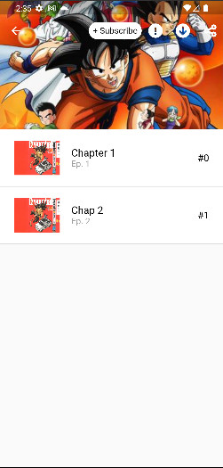

Clicking the subscribe button will change it to a subscribed button and it is also recorded on the database that the current user has subscribed to this comic.

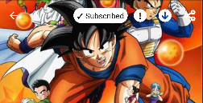

Also, the subscribed comic will be displayed on user's ForYouScreen and MyScreen.

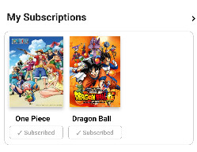
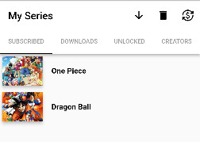

# ComicScreen
Display the content of a chapter in the comic as a vertical listview and an app bar that appears/disappears on touch and on scroll.

# TODO

* Function and layout that user can add, update, delete new comic.
* Download a comic chapter, it will be saved on device but can be loaded offline on the app.
* New layout to display novel (text comic) data

